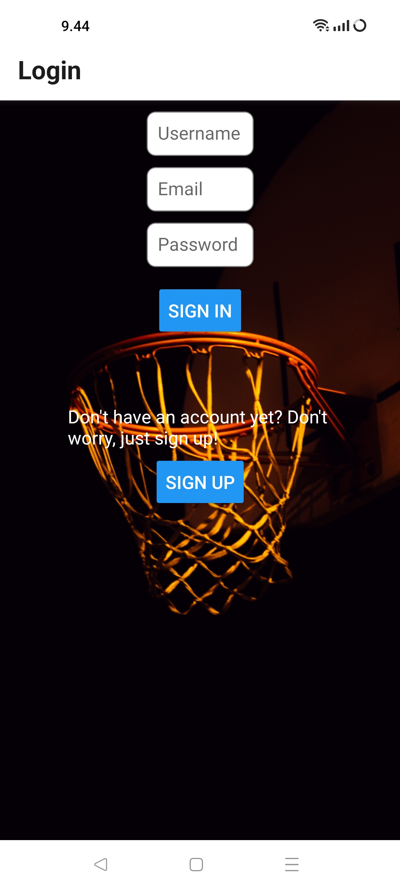
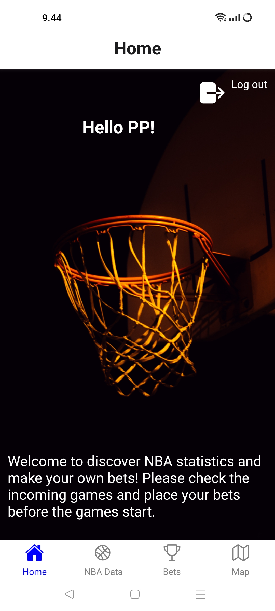

# NBA-app

A group of friends can explore various NBA statistics, teams, and arenas on maps, and place their own bets on upcoming games.

# Technologies used in project

- React and React Native
- Firebase Authentication
- Firebase Realtime Database
- Connected to API data from API-NBA

# UI
<div style="display: flex; justify-content: space-between;">





</div>
<div style="display: flex; justify-content: space-between;">


</div>
<div style="display: flex; justify-content: space-between;">


</div>


## Installation

1. **Clone the repository:**
```bash
git clone https://github.com/piialairi/NBA-app.git
cd NBA-app
```
2. Install dependencies:
```bash
npm install
```
3. Configure environmental variables
- Create a '.env' file in the project root
- Add the necessary environmental variables such as 
    - API key from [API-NBA](https://rapidapi.com/api-sports/api/api-nba)
    - Firebase configurations and API key from [Firebase](https://firebase.google.com/)
    - API key from [MapQuest](https://developer.mapquest.com/)

## Usage

```bash
npx expo start
```

## License

This project is licensed under the terms of [GNU GPL](https://github.com/piialairi/NBA-app/blob/master/LICENSE.md).

